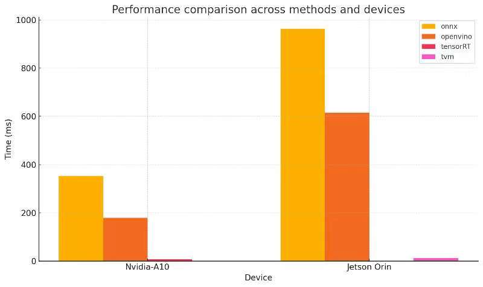
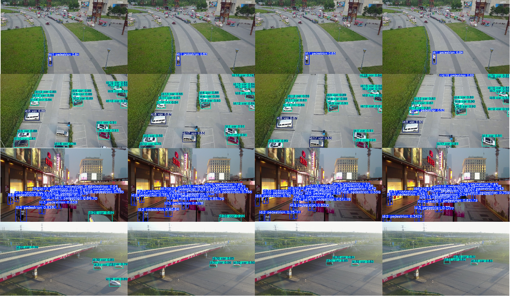
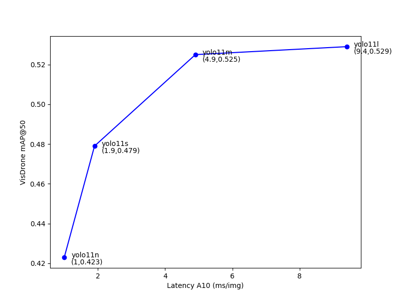

# Approaches 

### Transformer

### GNN

### clustering

### Kalman filter

# Extended Experiment

## expriment setup

### VisDrone dataset
**hardware :**

NVIDIA A1O

**requirement:** 

ultralytics
### TVM implement
**hardware :**

NVIDIA Jetson Orin

**requirement:** 

onnxruntime 

onnxslim

openvino

tvm

**TVM setup**

>Install clang+llvm (version >= 15.0)

>Install tvm from Source according to https://tvm.apache.org/docs/install/from_source.html
>
>>echo "set(USE_LLVM \"llvm-config --ignore-libllvm --link-static\")" >> config.cmake
>
>>echo "set(USE_CUDA   ON)" >> config.cmake

### expriment result

>> see expriment folder 

